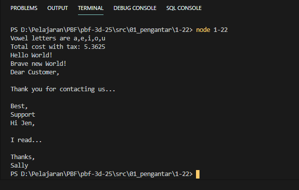

# Laporan Praktikum #14 - GUI dan Database

## Tujuan Pembelajaran

## Percobaan

### Percobaan 1-1

`Screenshot:`

`Kode Program:`

* [1-1](../../src/01_pengantar/1-1/1-1.js)

### Percobaan 1-2

`Screenshot:`

`Kode Program:`

* [1-2](../../src/01_pengantar/1-2/1-2.js)

### Percobaan 1-3

`Screenshot:`

`Kode Program:`

* [1-3](../../src/01_pengantar/1-3/1-3.js)

### Percobaan 1-4

`Screenshot:`

`Kode Program:`

* [1-4](../../src/01_pengantar/1-4/1-4.js)

### Percobaan 1-5

`Screenshot:`

`Kode Program:`

* [1-5](../../src/01_pengantar/1-5/1-5.js)

### Percobaan 1-6

`Screenshot:`

`Kode Program:`

* [1-6](../../src/01_pengantar/1-6/amazing.js)
* [1-6](../../src/01_pengantar/1-6/fantastic.js)
* [1-6](../../src/01_pengantar/1-6/wonderful.js)
* [1-6](../../src/01_pengantar/1-6/index.html)

### Percobaan 1-7

`Screenshot:`

`Kode Program:`

* [1-7](../../src/01_pengantar/1-7/1-7.js)

### Percobaan 1-8

`Screenshot:`

`Kode Program:`

* [1-8](../../src/01_pengantar/1-8/1-8.js)

### Percobaan 1-9

`Screenshot:`

`Kode Program:`

* [1-9](../../src/01_pengantar/1-9/1-9.js)

### Percobaan 1-10

`Screenshot:`

`Kode Program:`

* [1-10](../../src/01_pengantar/1-8/1-10.js)

### Percobaan 1-11

`Screenshot:`

`Kode Program:`

* [1-11](../../src/01_pengantar/1-11/1-11.js)

### Percobaan 1-12

`Screenshot:`

`Kode Program:`

* [1-12](../../src/01_pengantar/1-12/1-12.js)

### Percobaan 1-13

`Screenshot:`

`Kode Program:`

* [1-13](../../src/01_pengantar/1-13/1-13.js)

### Percobaan 1-14

`Screenshot:`

`Kode Program:`

* [1-14](../../src/01_pengantar/1-14/1-14-let.js)
* [1-14](../../src/01_pengantar/1-14/1-14-var.js)

### Percobaan 1-15

`Screenshot:`

`Kode Program:`

* [1-15](../../src/01_pengantar/1-15/1-15-const.js)
* [1-15](../../src/01_pengantar/1-15/1-15-let.js)

### Percobaan 1-16

`Screenshot:`

`Kode Program:`

* [1-16](../../src/01_pengantar/1-16/amazing.js)
* [1-16](../../src/01_pengantar/1-16/fantastic.js)
* [1-16](../../src/01_pengantar/1-16/wonderful.js)
* [1-16](../../src/01_pengantar/1-16/script.js)
* [1-16](../../src/01_pengantar/1-16/index.html)

### Percobaan 1-17

`Screenshot:`

`Kode Program:`

* [1-17](../../src/01_pengantar/1-17/amazing.js)
* [1-17](../../src/01_pengantar/1-17/fantastic.js)
* [1-17](../../src/01_pengantar/1-17/wonderful.js)
* [1-17](../../src/01_pengantar/1-17/script.js)
* [1-17](../../src/01_pengantar/1-17/index.html)

### Percobaan 1-18

`Screenshot:`

`Kode Program:`

* [1-18](../../src/01_pengantar/1-18/1-18.js)

### Percobaan 1-19

`Screenshot:`

`Kode Program:`

* [1-19](../../src/01_pengantar/1-19/1-19.js)

### Percobaan 1-20

`Screenshot:`

`Kode Program:`

* [1-20](../../src/01_pengantar/1-20/1-20.js)

### Percobaan 1-21

`Screenshot:`

`Kode Program:`

* [1-21](../../src/01_pengantar/1-21/1-21.js)

### Percobaan 1-22

`Screenshot:`

`Kode Program:`

* [1-22](../../src/01_pengantar/1-22/1-22.js)
