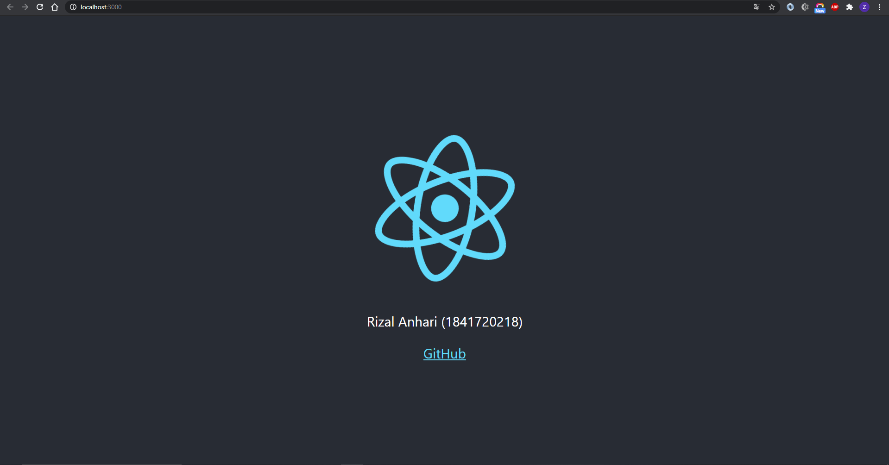

# Laporan Praktikum #2

## Tujuan Pembelajaran

1. Mahasiswa paham dengan konsep ReactJS dan membuat project menggunakan ReactJS

## Hasil Praktikum

`Screenshot:`

`Kode Program:`

* [Hello World](../../src/02_hello_world/hello)
