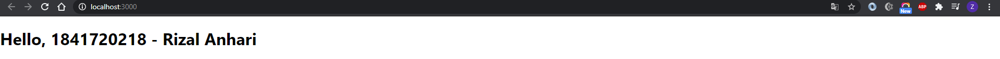
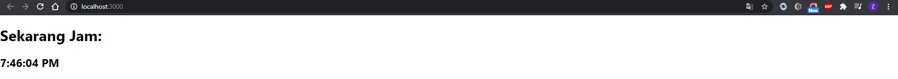
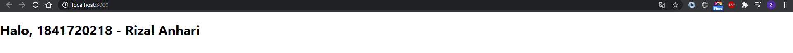
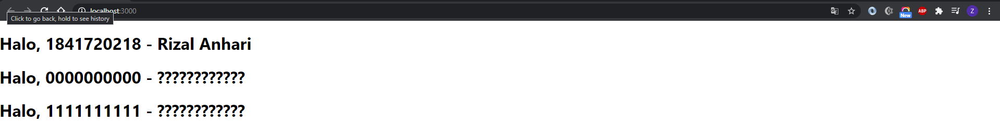
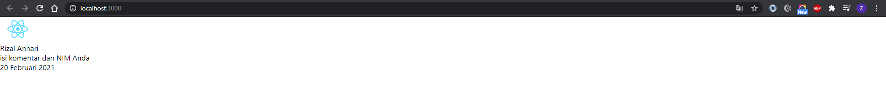
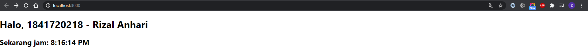

# Laporan Praktikum #3

## Tujuan Pembelajaran

1. Mahasiswa paham dengan konsep dan komponen dalam reactJS

## Praktikum

### Praktikum1

`Screenshot:`

`Kode Program:`

* [Praktikum1](../../src/03_konsep_reactjs/praktikum1)

### Praktikum2

`Screenshot:`

`Kode Program:`

* [Praktikum2](../../src/03_konsep_reactjs/praktikum2)

### Praktikum3

`Screenshot:`

`Kode Program:`

* [Praktikum3](../../src/03_konsep_reactjs/praktikum3)

### Praktikum4

`Screenshot:`

`Kode Program:`

* [Praktikum4](../../src/03_konsep_reactjs/praktikum4)

### Praktikum5

`Screenshot:`

`Kode Program:`

* [Praktikum5](../../src/03_konsep_reactjs/praktikum5)

### Praktikum6

`Screenshot:`

`Kode Program:`

* [Praktikum6](../../src/03_konsep_reactjs/praktikum6)
