# Laporan Praktikum #4

## Tujuan Pembelajaran

1. Mahasiswa paham dengan konsep interaksi didalam reactJS

## Praktikum

### Praktikum1

`Screenshot:`

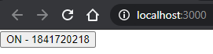

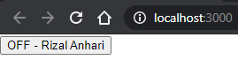

`Kode Program:`

* [Praktikum1](../../src/04_konsep_reactjs_part2/praktikum1)

### Praktikum2

`Screenshot:`

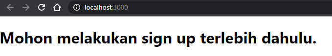

`Kode Program:`

* [Praktikum2](../../src/04_konsep_reactjs_part2/praktikum2)

### Praktikum3

`Screenshot:`

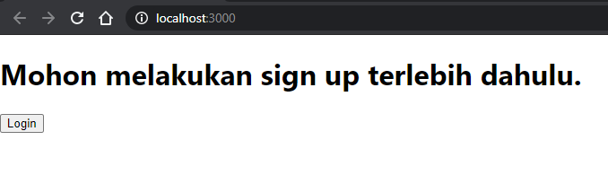

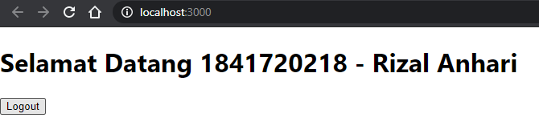

`Kode Program:`

* [Praktikum3](../../src/04_konsep_reactjs_part2/praktikum3)

### Praktikum4

`Screenshot:`

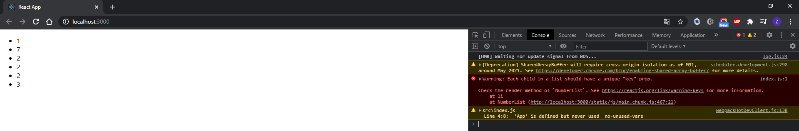
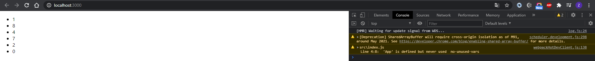

`Kode Program:`

* [Praktikum4](../../src/04_konsep_reactjs_part2/praktikum4)

### Praktikum5

`Screenshot:`

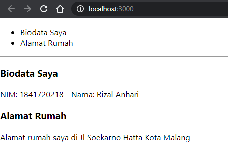

`Kode Program:`

* [Praktikum5](../../src/04_konsep_reactjs_part2/praktikum5)

### Praktikum6

`Screenshot:`

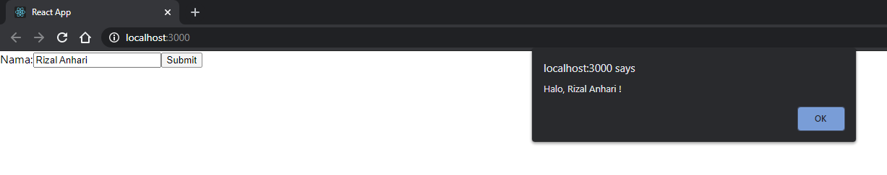

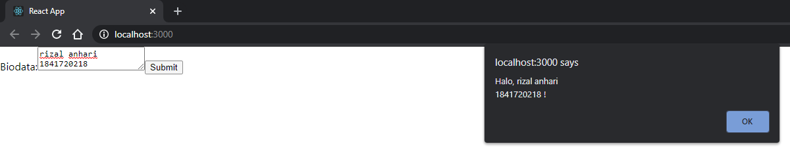

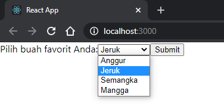

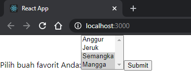

`Kode Program:`

* [Praktikum6](../../src/04_konsep_reactjs_part2/praktikum6)
