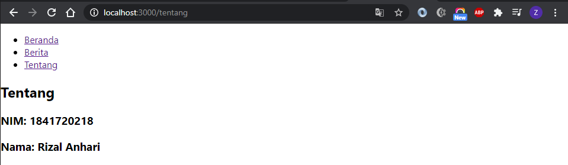

# Laporan Praktikum #5

## Tujuan Pembelajaran

1. Mahasiswa paham dengan cara instalasi reactrouter
2. Mahasiswa dapat mengetahui konsep reactrouter

## Praktikum

### Praktikum1

`Screenshot:`

`Kode Program:`

* [Praktikum1](../../src/05_api_router_reactjs/praktikum1)

### Praktikum2

`Screenshot:`

`Kode Program:`

* [Praktikum2](../../src/05_api_router_reactjs/praktikum2)

### Praktikum3

`Screenshot:`

`Kode Program:`

* [Praktikum3](../../src/05_api_router_reactjs/praktikum3)

### Tugas

`Screenshot:`

`Kode Program:`

* [Tugas](../../src/05_api_router_reactjs/tugas)
