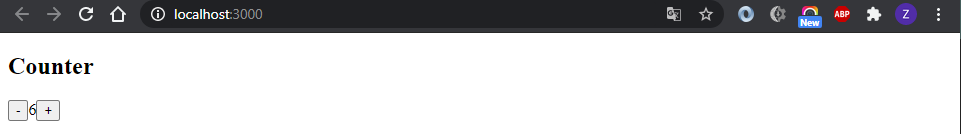
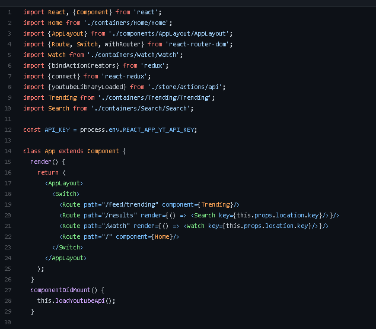
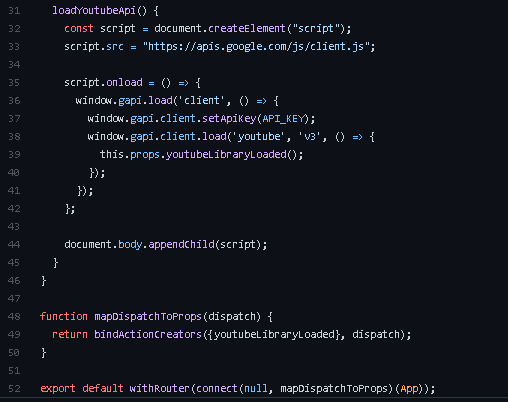

# Laporan Praktikum #6

## Tujuan Pembelajaran

1. Mahasiswa dapat memahami konsep state management dalam redux
2. Mahasiswa dapat menerapkan redux dalam reactapp

## Praktikum

`Screenshot:`

`Kode Program:`

* [Praktikum1](../../src/06_redux)

### Tugas

1. Dispatch adalah fungsi dari store redux yang digunakan untuk mengirim sebuah action dan mentrigger perubahan state(<https://react-redux.js.org/using-react-redux/connect-mapdispatch>)

2. Istilah Redux

    * Action merupakan sebuah object yang memiliki property type yang mana object action ini nantinya akan dikirim ke Store(<https://medium.com/easyread/belajar-redux-dalam-3-menit-b9afc7bc59f0>)

    * Reducer adalah bagian redux yang merubah state menjadi respon yang terjadi ketika Action di dispatch(<https://medium.com/easyread/belajar-redux-dalam-3-menit-b9afc7bc59f0>)

    * Action Creator adalah fungsi yang menghasilkan action(<https://medium.com/skyshidigital/dasar-membuat-perubahan-state-aplikasi-redux-5bd607a5d831>)

    * Middleware merupakan sebuah alat yang digunakan untuk merubah hasil dari request sebelum masuk menjadi response(<https://medium.com/skyshidigital/manajemen-state-redux-dengan-middleware-820fe4fbe6c0>)

    * Pure function adalah sebuah kondisi dimana sebuah fungsi tidak boleh mengubah input value yang diberikan (immutable) sehingga fungsi tersebut tidak memberikan side effect(<https://medium.com/println-mic/weekly-progress-5-lorem-ipsum-dolor-sit-amet-517330ede7ba>)

    * Imutability adalah value yang tidak bisa dirubah(<https://www.techfor.id/pengertian-konsep-immutable-dalam-react-js/>)

3. untuk menghubungkan atau membuat koneksi counter dengan react redux

4. Contoh Redux

Aplikasi ini berupa API Data Youtube menggunakan React-Redux. Bisa dilihat pada code program diatas terdapat proses import redux. yang berupa `bindActionCreator` dan `connect`

pada code program diatas komponent akan dihubungkan ke store kemudian function `mapDispatchToProps` untuk mengambil data dari store. Dimana data dari store akan masuk pada komponent sebagai pops.
`Source` (<https://github.com/productioncoder/youtube-react>)
