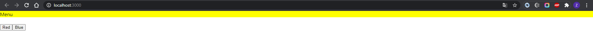
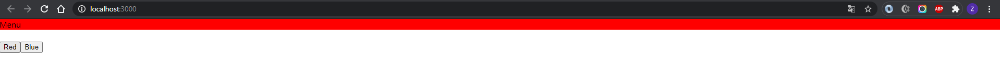
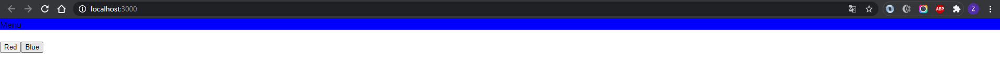

# Laporan Praktikum #7

## Tujuan Pembelajaran

1. Mahasiswa mengetahui dan memahami konsep redux dalam reactApp
2. State management dengan context API

## Praktikum

`Screenshot:`

`Kode Program:`

* [Praktikum](../../src/07_context_hoc)
