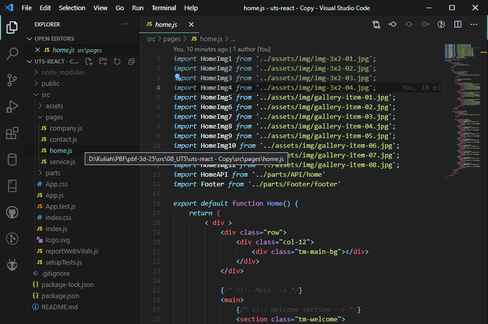
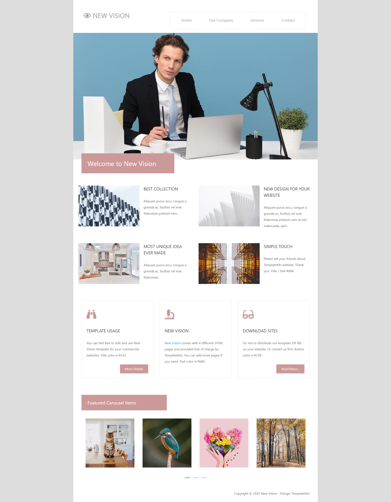
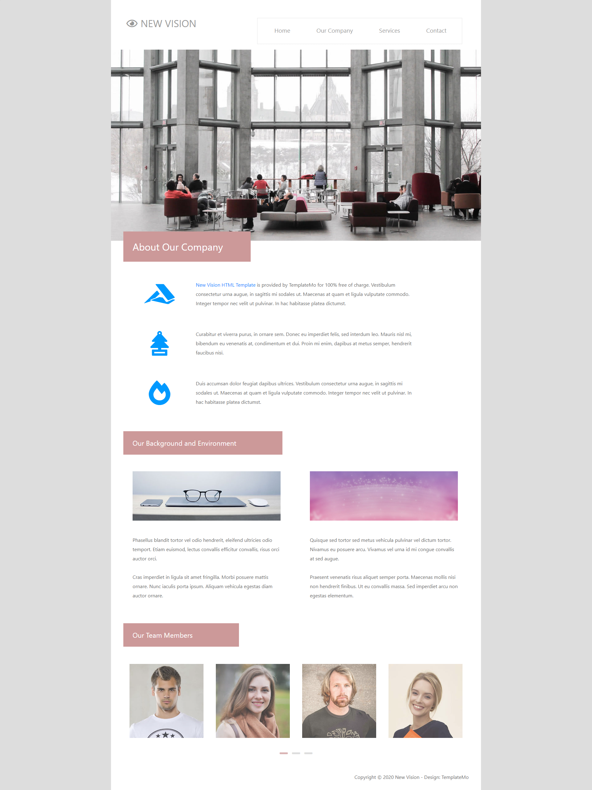
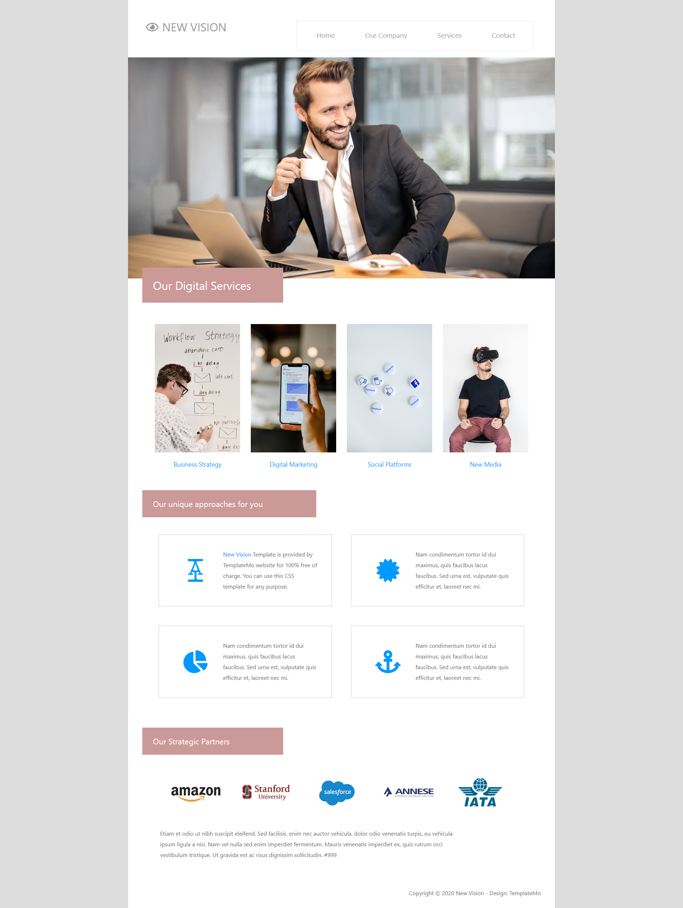
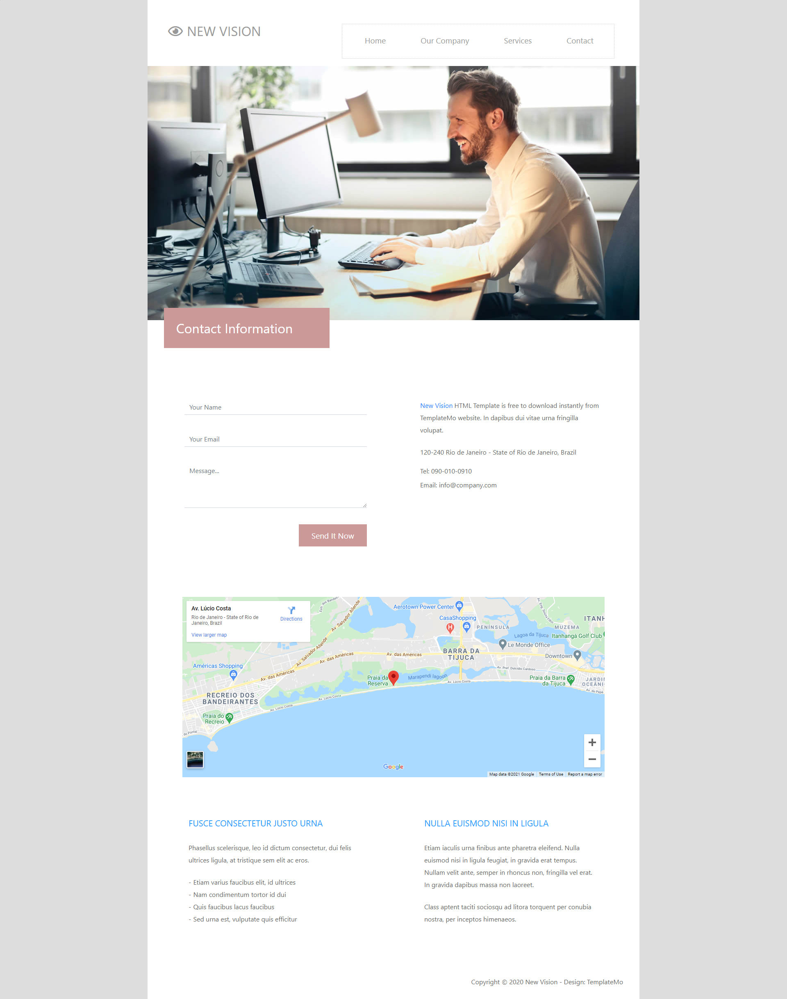
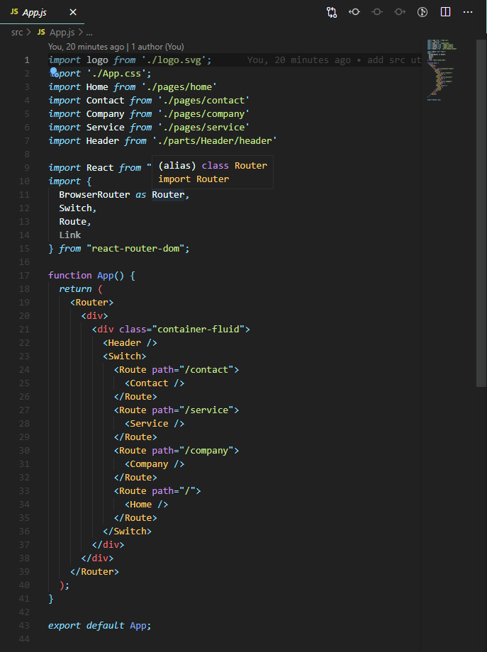
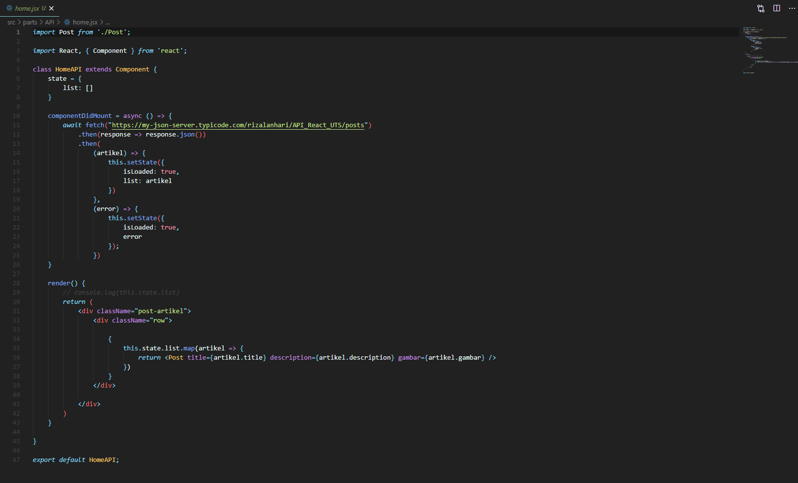
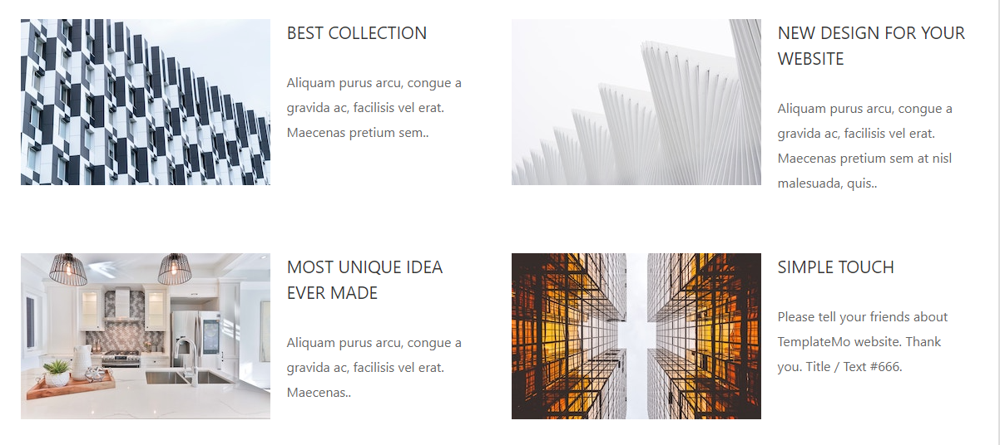
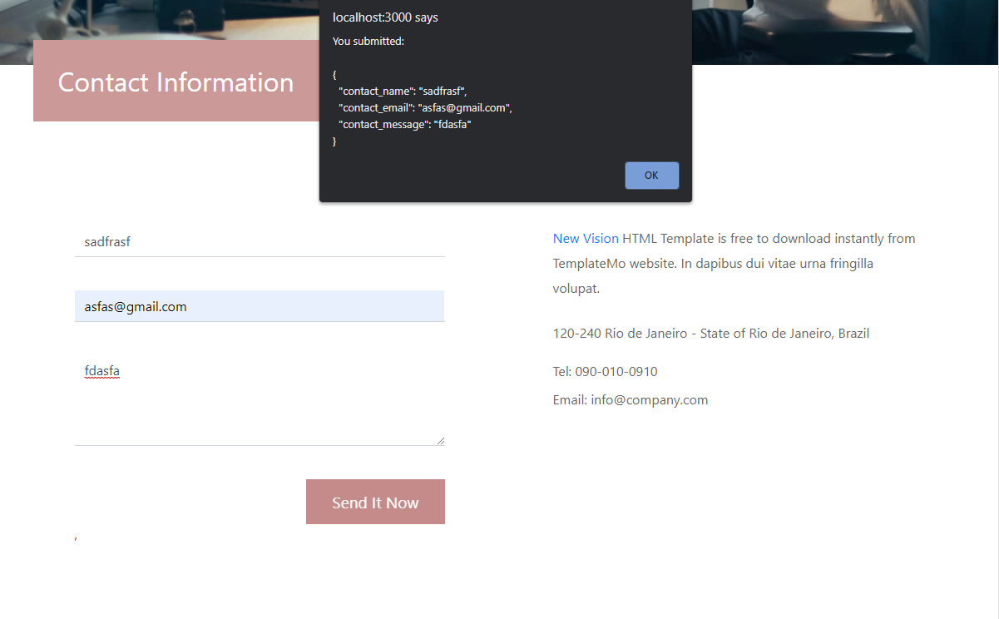

# Laporan UTS #8

## UTS

### Aplikasi React(SPA)

`Struktur Project:`

`Home Page`

`Company Page`

`Service Page`

`Contact Page`

`Kode Program:`

* [code](../../src/08_UTS/uts-react)

### React Router

`React Router:`

`Kode Program:`

* [code](../../src/08_UTS/uts-react/src/App.js)

### API

`API:`

`Hasil`

`Kode Program:`

* [code](../../src/08_UTS/uts-react/src/services/API/home.jsx)
* [Json](https://github.com/rizalanhari/API_React_UTS/blob/master/db.json)

### Redux

`Redux Form:`

`Kode Program:`

* [reducer](../../src/08_UTS/uts-react/src/store/reducers/index.js)
* [from](../../src/08_UTS/uts-react/src/parts/SimpleForm.js)
* [result/pop-up](../../src/08_UTS/uts-react/src/parts/showResults.js)
* [contact.js](../../src/08_UTS/uts-react/src/pages/contact.js)
