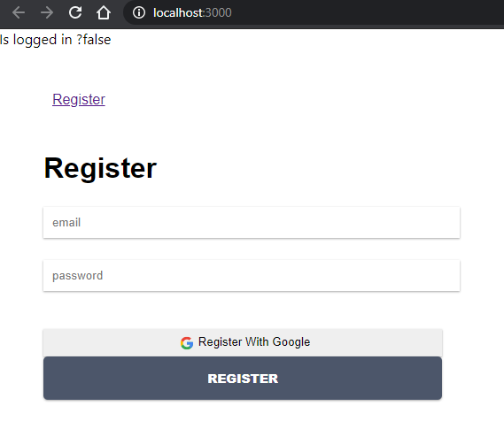
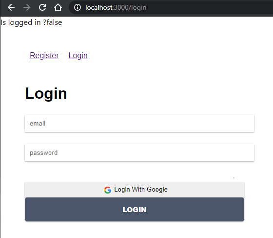
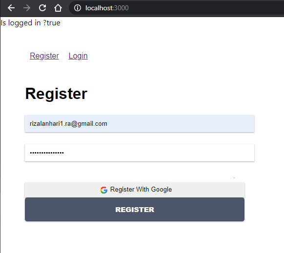
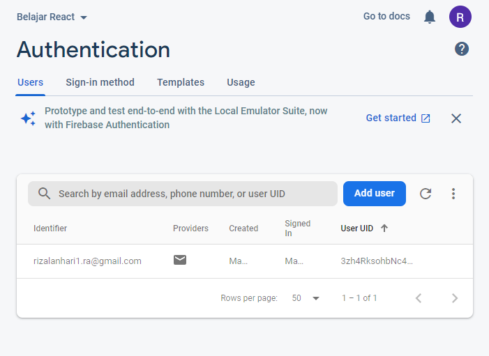
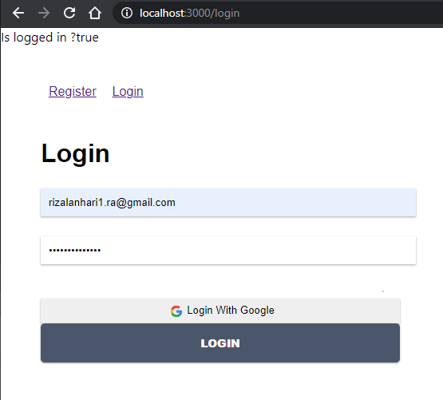

# Laporan Praktikum #10

## Tujuan Pembelajaran

1. Mahasiswa mengetahui dan memahami konsep firebase
2. Mahasiswa dapat membuat firebase sendiri

## Kode Program

`Kode Program:`

* [Kode Program](../../src/10_firebase_reactjs/firebase-app)

## Praktikum

### Praktikum 1: Membuat Form Register

`Screenshot:`

### Praktikum 2: Membuat Form Login

`Screenshot:`

### Praktikum 3: Membuat Koneksi ke Firebase

`Screenshot:`

### Tugas
