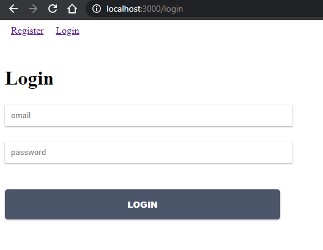
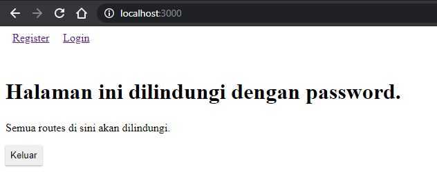

# Laporan Praktikum #11

## Tujuan Pembelajaran

1. Mahasiswa mengetahui dan memahami konsep firebase
2. Mahasiswa dapat membuat firebase sendiri

## Kode Program

`Kode Program:`

- [Kode Program](../../src/11_redux_thunk/firebase-app)

## Praktikum

### Praktikum 1

`Screenshot:`

## Tugas

1. Berdasarkan praktikum yang telah Anda lakukan, jelaskan perbedaan fitur yang ada dalam komponen Login dan Home! Mengapa komponen Login tidak menggunakan class seperti pada komponen Home ?
2. Jelaskan kegunaan dan alur logika dari protectedRoute.js !
3. Coba lakukan login dengan email atau password yang salah, apa yang terjadi? Jelaskan!
4. Jika Anda berada di halaman Home, coba akses form login tanpa melakukan logout. Apakah form login bisa diakses? Jelaskan!
5. Tambahkan menu Register pada form login sehingga user yang belum terdaftar dapat melakukan registrasi! Jika registrasi sukses, maka user langsung diarahkan ke halaman Home.

`jawab`

1. Pada halaman login terdapat fitur isAuthenticated untuk melakukan pengecekan terhadap user dan karena pada bagian login memanfaatkan fitur useState, dimana dia tidak akan bisa dipanggil jika menggunakan class, apakah sudah login atau belum. Sedangkan dihalaman Home tidak ada
2. pembungkus disekitar komponen Route yang disediakan oleh react-router.protectedRoute dapat digunakan sebagai pengganti Route normal untuk membuat route terlindungi yang beraksi terhadap perubahan status otentikasi aplikasi.
3. Jika email atau password tidak sesuai akan mengeksekusi loginError dan muncul pesan Email atau Password Salah!
   4.Tidak bisa diakses. Karena terdapat auth, untuk mengakses login maupun register harus dalam keadaan isAuthenticated false
4. Menambahkan menu register
