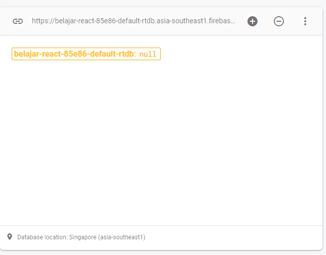
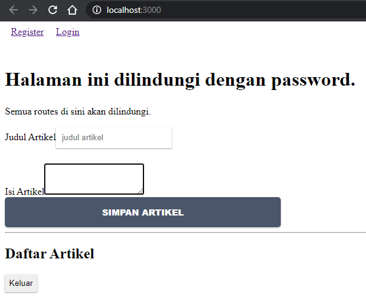
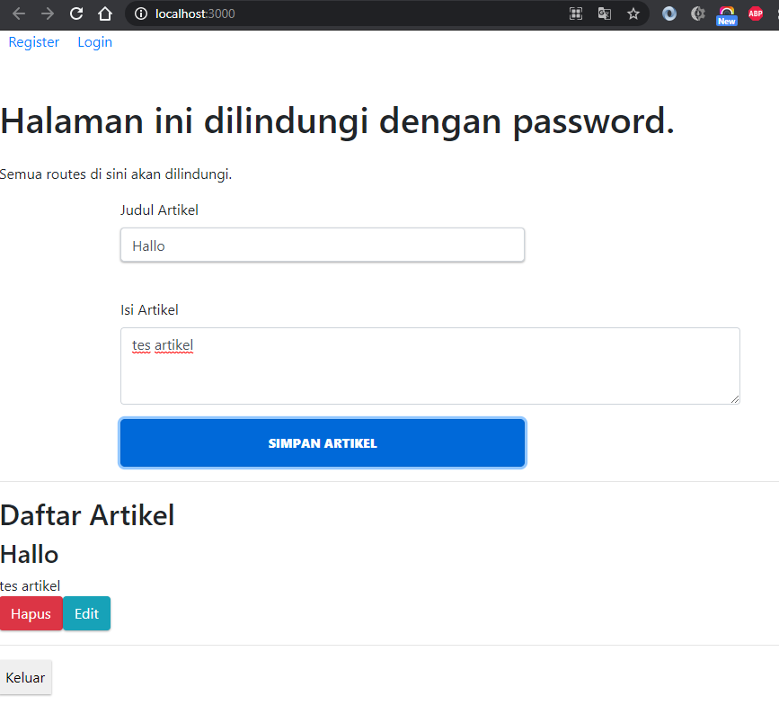

# Laporan Praktikum #12

## Tujuan Pembelajaran

1. Mahasiswa paham dengan konsep firebase
2. Mahasiswa dapat melakukan CRUD pada firebase

## Kode Program

`Kode Program:`

- [Kode Program](../../src/12_crud_firebase/firebase-app)

## Praktikum

### Praktikum 1: Konfigurasi Database Firebase

`Screenshot:`

### Praktikum 2: Membuat Fungsi Create Artikel

`Screenshot:`

### Praktikum 3: Membuat Fungsi Hapus Artikel

`Screenshot:`

### Praktikum 4: Membuat Fungsi Edit (Update) Artikel

`Screenshot:`

## Tugas