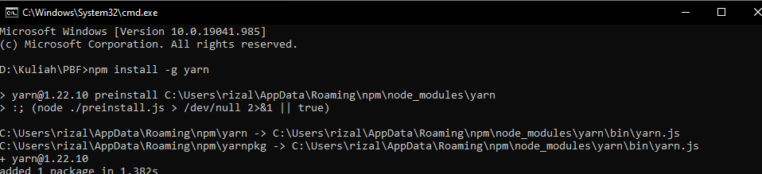
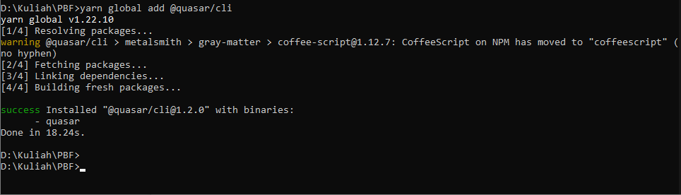
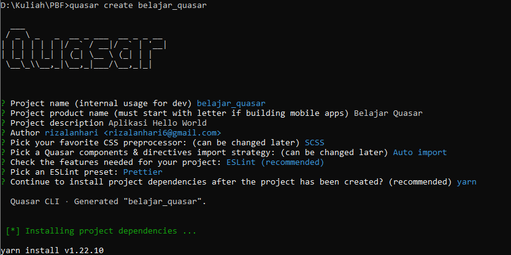
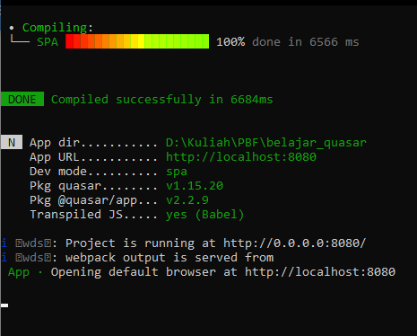
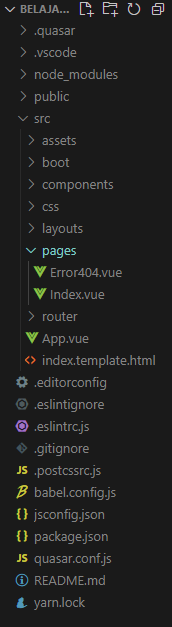
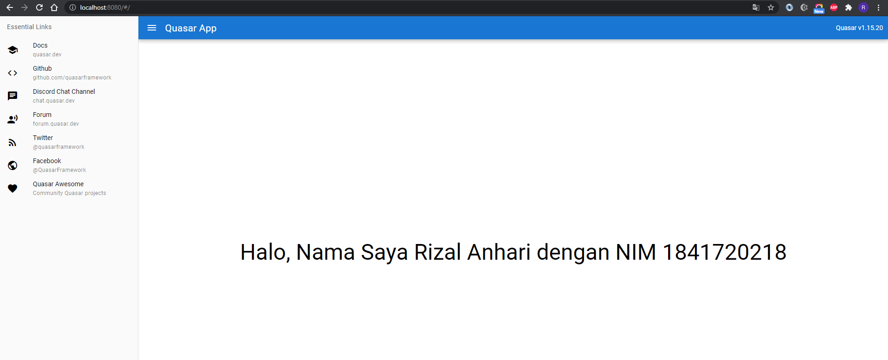

# Laporan Praktikum #13

## Tujuan Pembelajaran

1. Mahasiswa paham dengan konsep dasar Quasar

## Kode Program

`Kode Program:`

- [Kode Program](../../src/12_crud_firebase/firebase-app)

## Praktikum

### Praktikum 1: Memulai Quasar Framework

`Screenshot:`

### Praktikum 2: Membuat Aplikasi Pertama

`Screenshot:`

## Tugas

1. Berdasarkan praktikum 1 yang telah Anda lakukan, jelaskan kegunaan file quasar.conf.js ?
2. Jelaskan maksud istilah SPA, SSR, PWA, BEX, Electron app, Cordova, dan Linting code!
3. Jelaskan maksud dan perbedaan ES6, ECMAScript 6, dan ECMAScript 2015 !

`Jawab:`

1. Berdasarkan dari web Quasar-nya sendiri ([Klik disini untuk Source](https://next.quasar.dev/quasar-cli/quasar-conf-js)) kegunaan /quasar.conf.js ialah:

- Merupakan komponen, arahan, dan plugins yang akan digunakan di website/app

- Default dari [Quasar Language Pack](https://next.quasar.dev/options/quasar-language-packs)

- [Icon Libraries](https://next.quasar.dev/options/installing-icon-libraries) yang dibutuhkan

- Default daripada [Quasar Icon Set](https://next.quasar.dev/options/quasar-icon-sets) untuk komponen Quasar sendiri

- Development server port, HTTPS mode, hostname dan masih banyak lagi

- [CSS Animation](https://next.quasar.dev/options/animations) yang bakal dibutuhkan

- List [Boot Files](https://next.quasar.dev/quasar-cli/boot-files) (Yang menentukan perintah dari eksekusi) - files yang ada di /src/boot yang memberi tahu bagaimana app anda di initialize sebelum menyambung ke akar VUE komponen

- Global CSS/Sass/... file yang akan tercantum di bundle

- PWA [Manifest](https://next.quasar.dev/quasar-cli/developing-pwa/configuring-pwa#Configuring-Manifest-File) dan [Workbox Options](https://next.quasar.dev/quasar-cli/developing-pwa/configuring-pwa#Quasar.conf.js)

- [Electron Packager](https://next.quasar.dev/quasar-cli/developing-electron-apps/configuring-electron#Quasar.conf.js) dan/atau [Electron Builder](https://next.quasar.dev/quasar-cli/developing-electron-apps/configuring-electron#Quasar.conf.js)

- Extend Webpack config

2. Berikut penjelasannya:

- SPA (Single Page App) : Menurut [MDN Website Documentation](https://developer.mozilla.org/en-US/docs/Glossary/SPA), SPA (Single-Page Application) adalah implementasi aplikasi web yang memuat hanya satu dokumen web dan meng-update body content dari single document tersebut via JavaScript API seperti [XMLHttpRequest](https://developer.mozilla.org/en-US/docs/Web/API/XMLHttpRequest) dan [Fetch](https://developer.mozilla.org/en-US/docs/Web/API/Fetch_API) apabila konten yang berbeda ditampilkan

- SSR (Server-side Rendered App) : Perenderan sisi-server atau server-side rendering (SSR) adalah teknik populer untuk merender aplikasi laman tunggal (single page application atau SPA) sisi-klien pada server, lalu mengirim laman yang telah dirender sepenuhnya ke klien. Ini memungkinkan komponen dinamis untuk disajikan sebagai markup HTML statis

- PWA (Progressive Web App) : Metode pembuatan software dengan mengkombinasikan antara website reguler dengan aplikasi mobile & desktop

- BEX (Browser Extension)   : Ada dua jenis extension yang umum. Sebagian besar memperluas fungsionalitas browser itu sendiri atau mengintegrasikan layanan yang ada dengan browser.

- Electron App  : Electron adalah framework untuk membangun aplikasi desktop menggunakan JavaScript, HTML, dan CSS. Dengan menyematkan Chromium dan Node.js ke dalam binernya, Electron memungkinkan Anda mempertahankan satu basis kode JavaScript dan membuat aplikasi lintas platform yang berfungsi di Windows, macOS, dan Linux — tidak diperlukan pengalaman pengembangan asli.

- Cordova   : Apache Cordova adalah kerangka kerja pengembangan seluler sumber terbuka. Ini memungkinkan Anda untuk menggunakan teknologi web standar - HTML5, CSS3, dan JavaScript untuk pengembangan lintas platform.

- Linting Code  : Pemeriksaan otomatis pada source code untuk programatik dan stylistic errors. Ini dilakukan dengan menggunakan alat lint (atau dikenal sebagai linter). Alat lint adalah penganalisis kode statis dasar.

3. ES6 adalah sebuah singkatan dari ECMAScript versi 6. ES6 release pada tahun 2015, jadi ES6 sama ES 2015 sama aja. Lalu apa itu ECMAScript? ECMAScript adalah sebuah standarisasi scripting language (Javascript) yang dibuat oleh European Computer Manufacturers Association (ECMA). Bahasa gampangnya ECMAScript itu standarnya, Javascript itu implementasinya.

### Referensi
- https://www.digitalocean.com/community/tutorials/react-server-side-rendering-id

- https://www.softwareseni.co.id/blog/progressive-web-application-pwa 

- https://www.howtogeek.com/718676/what-is-a-browser-extension/

- https://www.electronjs.org/docs/tutorial/introduction

- https://cordova.apache.org/docs/en/10.x/guide/overview/index.html

- https://www.perforce.com/blog/qac/what-lint-code-and-why-linting-important

- https://medium.com/@renopp/kenalan-dengan-es6-javascript-introduction-variable-arrow-function-part1-6bd5c148473b 