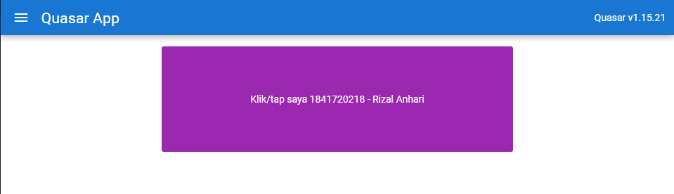
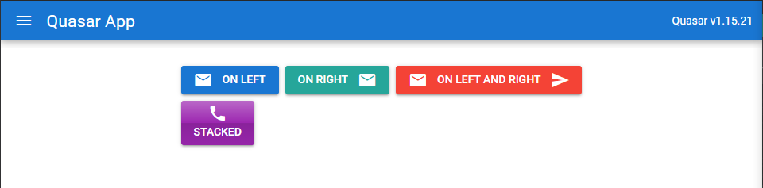

# Laporan Praktikum #13

## Tujuan Pembelajaran

1. Pengenalan Quasar Directives
2. Pengenalan Quasar Components

## Kode Program

`Kode Program:`

- [Kode Program](../../src/12_crud_firebase/firebase-app)

## Praktikum

### Praktikum 1: Menggunakan Quasar Directives

`Screenshot:`

### Praktikum 2: Menggunakan Quasar Components

`Screenshot:`

## Tugas

1. Berdasarkan praktikum 1 yang telah Anda lakukan, jelaskan maksud kode di template: class="q-pa-md row justify-center" ?  
   `Jawab`

2. Berdasarkan praktikum 1 pada langkah nomor 4, jelaskan maksud script tersebut seperti kegunaan konstanta colors, fungsi data(), computed, mounted, dan beforeDestroy() !  
   `Jawab`

3. Berdasarkan praktikum 2 pada langkah nomor 2, jelaskan maksud tiap kode HTML pada template yang mendefinisikan tiap button tersebut!  
   `Jawab`

4. Coba ganti kode template HTML pada praktikum 2 menjadi seperti berikut. Save file, lalu perhatikan apa yang terjadi ? Mengapa terjadi demikian, jelaskan!  
   `Jawab`
